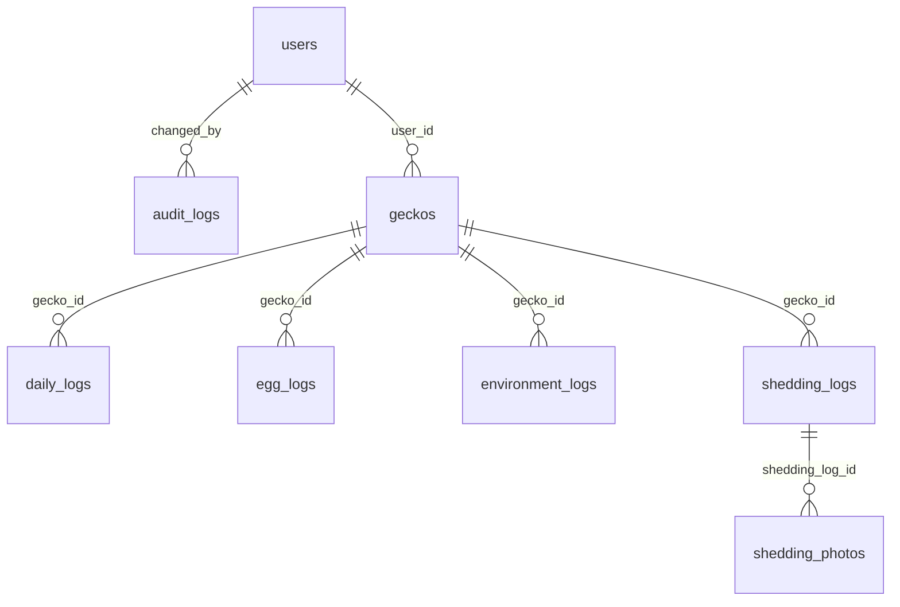

# 資料庫 Schema

> **本檔案由 `backend/scripts/generate_schema_doc.py` 自動產生，請勿手動編輯。**
> 來源：[`backend/app/models.py`](../../backend/app/models.py)。
> 每次異動 model 並執行 `alembic upgrade head` 後，於 `backend/` 目錄執行：
>
> ```bash
> python -m scripts.generate_schema_doc
> ```

- 產生時間：2026-08-24 14:45 UTC
- Alembic revision：`80e4a2510daf`

## ER 圖



## 資料表定義

### `users`

| 欄位 | 型別 | 限制 |
|---|---|---|
| id | UUID | PK, default=uuid4() |
| email | VARCHAR | not null |
| password_hash | VARCHAR | not null |
| created_at | DATETIME | not null, server_default |
| updated_at | DATETIME | not null, server_default, auto-update on write |
| is_deleted | BOOLEAN | not null, default=False, server_default |
| deleted_at | DATETIME | — |

UNIQUE(email) WHERE is_deleted = false（partial index：`uq_users_email_active`）

### `audit_logs`

| 欄位 | 型別 | 限制 |
|---|---|---|
| id | UUID | PK, default=uuid4() |
| table_name | VARCHAR | not null |
| record_id | UUID | not null |
| action | enum('insert', 'update', 'delete') | not null |
| diff | JSONB | not null |
| changed_by | UUID | FK → users.id |
| changed_at | DATETIME | not null, server_default |

### `geckos`

| 欄位 | 型別 | 限制 |
|---|---|---|
| id | UUID | PK, default=uuid4() |
| user_id | UUID | FK → users.id, not null |
| name | VARCHAR | not null |
| morph | VARCHAR | — |
| gender | enum('male', 'female', 'unknown') | not null, default='unknown' |
| birth_date | DATE | — |
| acquired_date | DATE | — |
| photo_path | TEXT | — |
| feeding_interval_days | INTEGER | not null, default=7 |
| note | TEXT | — |
| safe_temp_min | NUMERIC | — |
| safe_temp_max | NUMERIC | — |
| safe_humidity_min | NUMERIC | — |
| safe_humidity_max | NUMERIC | — |
| created_at | DATETIME | not null, server_default |
| updated_at | DATETIME | not null, server_default, auto-update on write |
| is_deleted | BOOLEAN | not null, default=False, server_default |
| deleted_at | DATETIME | — |

### `daily_logs`

進食＋排便＋體重，維持「一天一筆」組合方式，不拆表。

| 欄位 | 型別 | 限制 |
|---|---|---|
| id | UUID | PK, default=uuid4() |
| gecko_id | UUID | FK → geckos.id, not null |
| date | DATE | not null |
| status | enum('fed', 'partial', 'refused', 'skipped') | not null |
| qty | INTEGER | — |
| food | VARCHAR | — |
| food_size | VARCHAR | — |
| poop | BOOLEAN | not null, default=False |
| weight | NUMERIC | — |
| note | TEXT | — |
| created_at | DATETIME | not null, server_default |
| updated_at | DATETIME | not null, server_default, auto-update on write |
| is_deleted | BOOLEAN | not null, default=False, server_default |
| deleted_at | DATETIME | — |

UNIQUE(gecko_id, date) WHERE is_deleted = false（partial index：`uq_daily_logs_gecko_date_active`）

### `egg_logs`

| 欄位 | 型別 | 限制 |
|---|---|---|
| id | UUID | PK, default=uuid4() |
| gecko_id | UUID | FK → geckos.id, not null |
| date | DATE | not null |
| egg_count | INTEGER | not null |
| note | TEXT | — |
| created_at | DATETIME | not null, server_default |
| updated_at | DATETIME | not null, server_default, auto-update on write |
| is_deleted | BOOLEAN | not null, default=False, server_default |
| deleted_at | DATETIME | — |

### `environment_logs`

| 欄位 | 型別 | 限制 |
|---|---|---|
| id | UUID | PK, default=uuid4() |
| gecko_id | UUID | FK → geckos.id, not null |
| recorded_at | DATETIME | not null |
| temperature | NUMERIC | not null |
| humidity | NUMERIC | not null |
| source | enum('manual', 'sensor') | not null, default='manual' |
| created_at | DATETIME | not null, server_default |
| updated_at | DATETIME | not null, server_default, auto-update on write |
| is_deleted | BOOLEAN | not null, default=False, server_default |
| deleted_at | DATETIME | — |

### `shedding_logs`

| 欄位 | 型別 | 限制 |
|---|---|---|
| id | UUID | PK, default=uuid4() |
| gecko_id | UUID | FK → geckos.id, not null |
| date | DATE | not null |
| note | TEXT | — |
| created_at | DATETIME | not null, server_default |
| updated_at | DATETIME | not null, server_default, auto-update on write |
| is_deleted | BOOLEAN | not null, default=False, server_default |
| deleted_at | DATETIME | — |

### `shedding_photos`

| 欄位 | 型別 | 限制 |
|---|---|---|
| id | UUID | PK, default=uuid4() |
| shedding_log_id | UUID | FK → shedding_logs.id, not null |
| file_path | TEXT | not null |
| created_at | DATETIME | not null, server_default |
| updated_at | DATETIME | not null, server_default, auto-update on write |
| is_deleted | BOOLEAN | not null, default=False, server_default |
| deleted_at | DATETIME | — |
